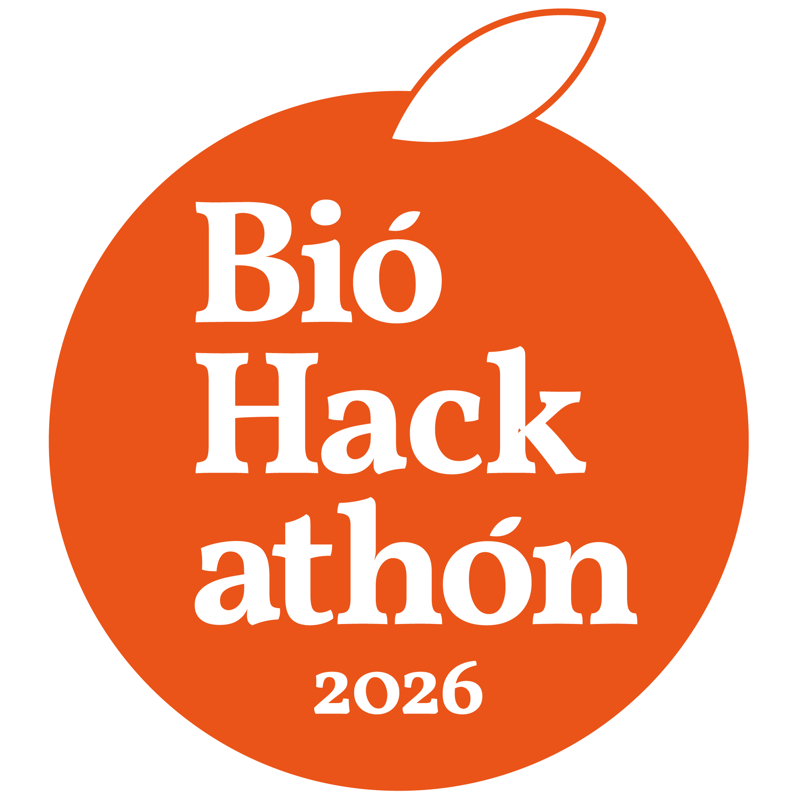
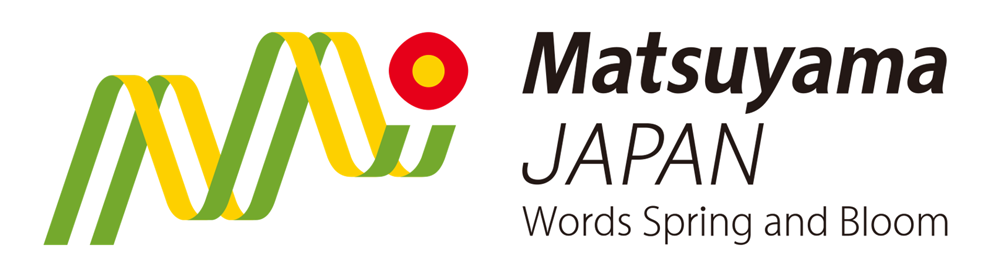

# DBCLS BioHackathon 2026

## Objectives

The BioHackathon in Japan, organized by the Database Division for Life Science (DBCLS), continues to prioritize the integrated use of databases in the life sciences, with a strong emphasis on interoperability, standardization, and the construction of FAIR knowledge graphs. In recent years, the development of tools and workflows for integrating heterogeneous biological and biomedical data—including multi-omics, imaging, clinical, and environmental data—has become increasingly central. This integration is key to enabling cross-domain analysis and improving reproducibility in data-driven research.

In addition, the rapid progress of large language models (LLMs) and other generative AI technologies opens new opportunities for extracting, linking, and reasoning over life science data. We aim to explore how these technologies can be effectively combined with curated databases and ontologies to enhance knowledge discovery, support hypothesis generation, and streamline research workflows. Through collaborative, hands-on hacking, the BioHackathon seeks to incubate innovative ideas and open solutions that push the boundaries of computational life science.

## Dates and venue

- Dates: 13th September (Sun) - 19th September (Sat), 2026
- Venue:
  - Opening Workshop: Riziere Matsuyama, Japan ([Google map](https://maps.app.goo.gl/bymEwtAGWaLWTqoE8))
  - Hackathon: [Ichiyu no Mori](https://www.okudogo.co.jp/en/) in Matsuyama, Japan ([Google map](https://maps.app.goo.gl/AbifWNE7brwMAPzV8))

## Registration

- Please register using the [~~registration form~~](https://docs.google.com/forms/d/e/1FAIpQLSdwD65najGo0DvsVFZw3KHdIJdD3RSMMibUdOHI745Fthi_YQ/viewform?usp=dialog) (General registration has closed.)

## Important dates

- July 23, 2026: Registration opens
- August 18, 2026: Registration closes
  - Register by August 11 to guarantee your T-shirt!

Note: Registration may be closed early if the number of participants exceeds the venue capacity.

## Information

- [Wiki](https://github.com/dbcls/bh26/wiki/)
- [Schedule](https://github.com/dbcls/bh26/wiki/Schedule)
- [Participants](https://github.com/dbcls/bh26/wiki/Participants)
- [Projects](https://github.com/dbcls/bh26/wiki/Projects)

## Organizers

- BioHackathon Management Organization, Database Division for Life Science

## Links

- [DBCLS](https://dbcls.rois.ac.jp/)
- [Past BioHackathons](http://biohackathon.org/)
- [BioHackathon Europe](https://biohackathon-europe.org/)
- [BioHackathon-MENA](https://github.com/biohackathon-mena)
- [BioHackathons in the US](https://biohackathons.github.io/)

## Support

* Database Division for Life Science (DBCLS)
* National Lifescience Database Project (NLDP) 
* Matsuyama Convention & Visitors Bureau   

<!--
## History of BioHackathon

A long time ago in a galaxy far, far away..

See [biohackathon.org](http://biohackathon.org/).
-->
